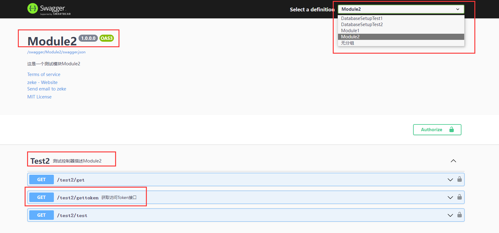
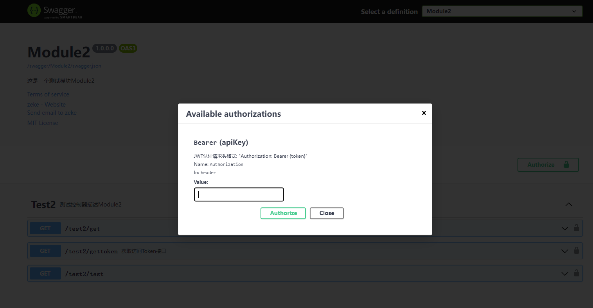
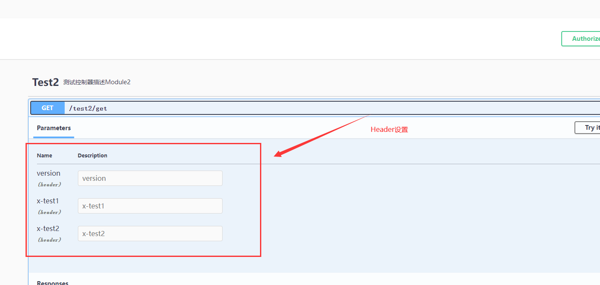

NetX使用Swagger进行api文档管理，并在其基础上进行扩展。

## <a name='Api-1'></a> Api分组功能与接口描述

```
[ApiControllerDescription("Module2", Description = "测试控制器描述Module2", HeaderKeys = new string[] { "version","x-test1","x-test2" })]
public class Test2Controller : BaseController
{
    [ApiActionDescription("获取访问Token接口")]
    [NoPermission]
    [HttpGet]
    public ActionResult GetToken()
    {
        return new JsonResult(_login.Handle(new ClaimModel()
        {
            UserId = "12345",
            LoginName = "abc",
            DisplayName = "zeke"
        }, String.Empty));
        //return Task.FromResult(Newtonsoft.Json.JsonConvert.SerializeObject( _login.Hand(claims.ToArray(), String.Empty)));
    }
}
```

> ApiControllerDescription 和 ApiActionDescription 特性完成了这一功能。<br/>
> ApiControllerDescription : 设置 分组名称，Controller描述，自定义Header<br/>
> ApiActionDescription : action信息描述



## <a name='ApiJWT'></a> Api接口（JWT）权限认证



## <a name='ApiHttpHeader'></a> Api接口支持自定义Http请求Header设置

