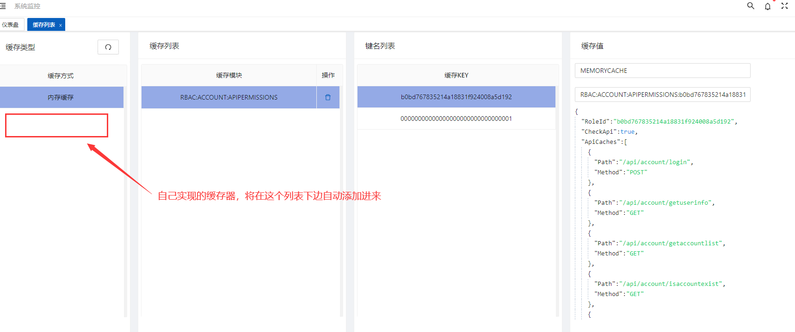

## <div id = 'memorycache'>内存缓存</div>

框架已经集成```MemoryCache```,可以直接注入使用

```
    [Scoped]
    public sealed class YourCache : IYourCache
    {
        private readonly ICacheProvider _cache;

        public PermissionCache(Func<string, ICacheProvider> funcFactory) 
        { 
            _cache = funcFactory(InMemoryCacheConstEnum.C_CACHE_TYPE_KEY);
        }
    }
```
> ```InMemoryCacheConstEnum.C_CACHE_TYPE_KEY``` 为内存缓存提供器唯一标识<br />
    ※ 注意：未提供内存缓存配置文件，如日侯需要，可通过配置文件方式集成

## 如何实现自己的缓存

1. 实现自己的provider(实现ICacheProvider接口)
    ```
    public class MemoryCacheProvider : ICacheProvider
    {
         public string CacheTypeKey => InMemoryCacheConstEnum.C_CACHE_TYPE_KEY;
    }
    ```
    > ```CacheTypeKey```为 注入时，工厂入参，筛选不同的缓存器 <br />
   
   使用方法请参考 [内存缓存](#memorycache)

## 约定大于配置
1. 缓存key要使用类进行管理，这样才能在缓存模块看到缓存具体信息
```
public static class CacheKeys
{
    /// <summary>
    /// 刷新令牌 
    /// <para>RBAC:ACCOUNT:REFRESH_TOKEN:刷新令牌</para>
    /// </summary>
    [Description("刷新令牌")]
    public const string AUTH_REFRESH_TOKEN = "RBAC:ACCOUNT:REFRESH_TOKEN:";
}
```
> - 缓存key命名规则 (采用网上redis的key命名规范)，约定大于配置<br /> 
> - 第一段放置项目名称或缩写
> - 第二段把表名转换key前缀
> - 第三段用于区分key的字段
> - 第四段防止主键值<br /> 
例如 ```RBAC:ACCOUNT:APIPERMISSIONS:xxxxxxx```,解读为：在RBAC模块，账号管理中，api授权缓存角色id为xxxx

2. 自己实现的缓存器也能在缓存管理中进行管理，需要注意一下几点
    - 一定要有唯一的缓存```C_CACHE_TYPE_KEY```
    - key命名一定要遵循上边的约定
  

