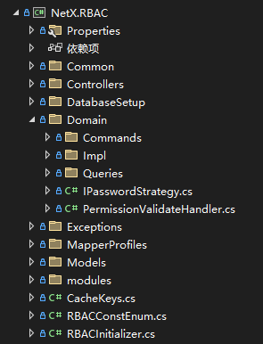

## 权限管理模块

采用 DomainDrivenDesign 设计思想进行开发（LITE DDD），代码结构简洁而清晰<br />
主要实现了RBAC 相关的如下模块：
- 账户管理
- API接口管理
- 部门管理
- 菜单管理
- 角色管理

## 目录结构



> Controller: api对外开放接口 <br />
Domain：核心领域
Model：Dto对象

## 代码使用示例

### 示例代码

1. Command

    - Controller处理
        
        ```
        public class AccountController : RBACBaseController
        {
            private readonly ICommandBus _accountCommand;

            /// <summary>
            /// 账号管理api实例对象
            /// </summary>
            /// <param name="accountService">账户管理服务</param>
            public AccountController(ICommandBus accountCommand)
            {
                this._accountQuery = accountQuery;
                this._accountCommand = accountCommand;
            }
            [Audited]
            [ApiActionDescription("注册添加新用户")]
            [HttpPost]
            public async Task<ResultModel> AddAccount(AccountRequestModel model)
            {
                await _accountCommand.Send<AccountAddCommand>(new AccountAddCommand(model.UserName, model.NickName, model.RoleId, model.DeptId, model.Email, model.Remark));
                return true.ToSuccessResultModel();
            }
        }

        ```
    - Domain处理
        ```            
        [Scoped]
        public class AccountRemoveCommandHandler : DomainCommandHandler<AccountRemoveCommand>
        {
            private readonly IUnitOfWork _uow;

            public AccountRemoveCommandHandler(
                IUnitOfWork uow)
            {
                _uow = uow;
            }

            public override async Task<bool> Handle(AccountRemoveCommand request, CancellationToken cancellationToken)
            {
                var user = await _uow.GetRepository<sys_user, string>().FirstOrDefaultAsync(p => p.Id == request.Id);
                if (null == user)
                    throw new RbacException($"未找到用户：{request.Id}", (int)ErrorStatusCode.UserNotFound);
                var roles = _uow.GetRepository<sys_user_role, string>().AsQueryable().Where(p => p.userid == request.Id);
                if (null != roles && roles.Any())
                    _uow.GetRepository<sys_user_role, string>().RemoveRange(roles);
                var depts = _uow.GetRepository<sys_user_dept, string>().AsQueryable().Where(p => p.userid == request.Id);
                if (null != depts && depts.Any())
                    _uow.GetRepository<sys_user_dept, string>().RemoveRange(depts);
                _uow.GetRepository<sys_user, string>().Remove(user);
                return await _uow.SaveChangesAsync();
            }
        }
        ```
2. Query

    - Controller处理
        ```
        public class AccountController : RBACBaseController
        {
            private readonly IQueryBus _accountQuery;

            /// <summary>
            /// 账号管理api实例对象
            /// </summary>
            /// <param name="accountService">账户管理服务</param>
            public AccountController(IQueryBus accountQuery)
            {
                this._accountQuery = accountQuery;
            }

            /// <summary>
            /// 系统登录
            /// </summary>
            /// <param name="model">登录系统实体对象</param>
            /// <returns></returns>
            [ApiActionDescription("登录")]
            [NoPermission]
            [HttpPost]
            public async Task<ResultModel> Login(LoginModel model)
            {
                return await this._accountQuery.Send<LoginQuery, ResultModel>(new LoginQuery(model.UserName, model.Password));
            }
        }
        ```
    - Domain处理
        ```
        [Scoped]
        public class LoginUserInfoQueryHandler : DomainQueryHandler<LoginUserInfoQuery, ResultModel>
        {
            private readonly IMapper _mapper;

            public LoginUserInfoQueryHandler(IDatabaseContext dbContext,
                IMapper mapper)
                : base(dbContext)
            {
                _mapper = mapper;
            }

            public override async Task<ResultModel> Handle(LoginUserInfoQuery request, CancellationToken cancellationToken)
            {
                var user = await base._dbContext.QuerySingleAsync<sys_user>($"SELECT * FROM sys_user where id =@id and status = 1", new { id = request.UserId });
                if (null == user)
                    return $"用户不存在：{request.UserId}".ToErrorResultModel<ResultModel>();
                return this._mapper.Map<UserModel>(user).ToSuccessResultModel();
            }
        }
        ```
## 说明

> Command 数据库访问使用的是 ```Entityframeworkcore``` <br />
Query 数据库访问使用的是 ```Dapper```


