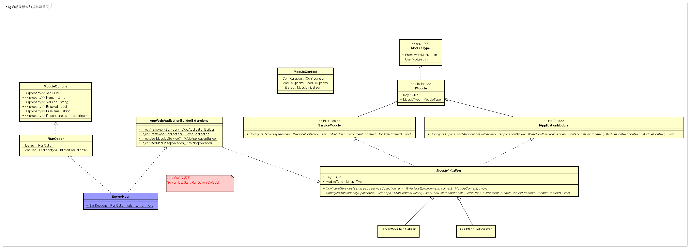

## <a name=''></a>程序启动加载模块类图

***



    ServerHost为程序入口函数，通过使用调用Start方法即可启动程序
    服务注入顺序 ： 系统组件 -> 启动参数配置组件 -> 用户自定义模块组件
    服务注入顺序 ： 系统组件 -> 启动参数配置组件 -> 用户自定义模块组件
    服务注入顺序 ： 系统组件 -> 启动参数配置组件 -> 用户自定义模块组件

## <a name='s-1'></a>简单无脑启动
  ```
    ServerHost.Start(RunOption.Default);
  ```
   > 自定义监听地址：netx.json 配置监听节点："urls": "http://*:8221",

## <a name='s-2'></a>自定义注入启动
```
ServerHost.Start(
    RunOption.Default
    .ConfigrationServiceCollection(p => p.AddScoped<IZeke, Zeke>())
    .ConfigApplication(p=>p.UseAuthentication()
    .ConfigrationManager(p=>p.AddJsonFile(""))
    );
```

## <a name='s-3'></a>带指定url启动方式 
```
    ServerHost.Start(RunOption.Default, "http://*:8220");
```

## <a name='s-4'></a>用户如何自定义模块

- 新建NetCore类库，并创建 ModuleInitializer.cs 文件（文件名随意，但，必须继承 ```ModuleInitializer``` 抽象类）
    ```
    public class ModuleInitializer1 : ModuleInitializer
    {
        public ModuleInitializer1()
        {
        }

        //必须唯一
        public override Guid Key => new Guid("00000000000000000000000000000002");
        //声明为 用户模块
        public override ModuleType ModuleType => ModuleType.UserModule;

        //自行注入 application
        public override void ConfigureApplication(IApplicationBuilder app, IWebHostEnvironment env, ModuleContext context)
        {
            
        }

        // 自行注入 services
        public override void ConfigureServices(IServiceCollection services, IWebHostEnvironment env, ModuleContext context)
        {
           
        }
    }
    ```

- 将自定义模块生成的dll，拷贝到启动程序目录下，目录结构如下：
    
    ```
    启动程序根目录
        |
        ├─modules
        │  ├─module1
        │  │  └─ref
        |  |-- module1.dll
        |  |-- plugin.json
        │  ├─module2
        │  │  └─ref
        |  |-- module2.dll
        |  |-- plugin.json
    ```

    > 采用约定大于配置的原则，必须NetX在启动程序根目录下建立modules文件夹 <br/>
    > 为每一个用户模块定义一个模块文件夹（例如 module1 和 moudle2 分别为2个自定义模块）<br/>
    > 用户模块文件夹包含3个内容： <br/>
        1. ref为文件夹，存放用户模块依赖的一些外部文件 <br/>
        2. module1.dll 上边工程产生的动态链接库<br/>
        3. plugin.json 模块配置文件，请参考如下说明<br/>

    ```
        {
            "Id": "00000000000000000000000000000001",
            "Name": "modulename",
            "Version": "1.0.0.0",
            "Enabled": true,
            "FileName": "module1.dll",
            "IsSharedAssemblyContext":true,
            "Description":"模块描述信息"
        }

    ```

    > id: 唯一标识，与 ``` ModuleInitializer.cs ``` 中的 ```Key``` 保持一致 <br/>
    > Name: 模块的名称 <br/>
    > Version: 模块的版本 <br/>
    > Enabled: 是否启功该模块 <br/>
    > FileName: 业务模块动态链接库名称 <br/>
    > IsSharedAssemblyContext: 是否为共享AssemblyContext <br/>
    -----> true : 与NetX共用程序集 <br/>
    -----> false: 独立程序集

